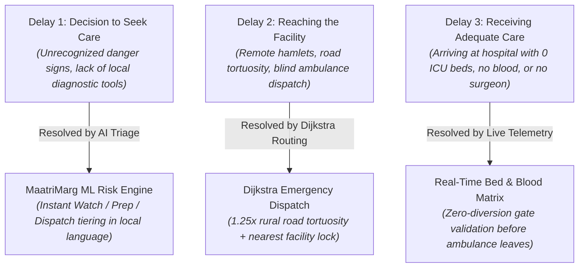
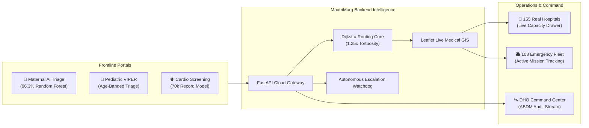
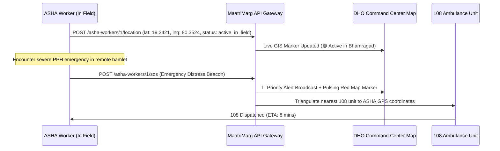

# 🌿 MAATRIMARG: Maternal & Infant Healthcare Intelligence Platform
### *Intelligent Triage, Regional Bed Telemetry, Algorithmic 108 Dispatch & Frontline Safety Infrastructure*

---

## 📋 Table of Contents
1. [Executive Summary & Hackathon Context](#1-executive-summary--hackathon-context)
2. [The Core Problem & The "Three Delays" Model](#2-the-core-problem--the-three-delays-model)
3. [The Core Idea & Vision of MaatriMarg](#3-the-core-idea--the-vision-of-maatrimarg)
4. [What We Are Actually Building (System Scope)](#4-what-we-are-actually-building-system-scope)
5. [What Has Been Built (Completed Inventory)](#5-what-has-been-built-completed-inventory)
6. [Machine Learning & Clinical AI Decision Engines](#6-machine-learning--clinical-ai-decision-engines)
7. [Algorithmic Routing & Real GIS Infrastructure](#7-algorithmic-routing--real-gis-infrastructure)
8. [ASHA Worker Live Tracking & Safety Gateway](#8-asha-worker-live-tracking--safety-gateway)
9. [User Personas & Operational Workflows](#9-user-personas--operational-workflows)
10. [Technical Stack & Architecture Specifications](#10-technical-stack--architecture-specifications)
11. [Complete API Endpoints & Data Model Schema](#11-complete-api-endpoints--data-model-schema)
12. [Hackathon Evaluation & Pitch Highlights](#12-hackathon-evaluation--pitch-highlights)

---

## 1. Executive Summary & Hackathon Context

| Attribute | Specification |
|---|---|
| **Project Name** | **MaatriMarg** (*"The Mother's Pathway"*) |
| **Hackathon** | **Smart India Hackathon (SIH)** |
| **Problem Statement ID** | **PS 26133** |
| **Theme / Category** | MedTech / Healthcare & Biomedical Devices / Digital Public Infrastructure |
| **Target Beneficiaries** | Expectant Mothers, Infants (0–60m), Frontline ASHA Workers, Hospital CMOs, District Health Officers (DHOs) |
| **Geographic Scope** | Regional Command Matrix across **Maharashtra & Tamil Nadu** (57 Districts, 165 Real Facilities) |
| **Core Value Proposition** | Eliminates maternal gate-rejections and transport delays through **predictive AI triage**, **live bed/blood inventory telemetry**, **tortuosity-adjusted Dijkstra routing**, and **real-time frontline ASHA tracking**. |

---

## 2. The Core Problem & The "Three Delays" Model

Every year in India, thousands of preventable maternal and neonatal deaths occur not because medical treatments do not exist, but because of systemic logistical delays. In global public health, this is formalized as the **Three Delays Model**:



### The Critical Real-World Breakdown:
1. **Blind Referrals:** An ASHA worker in a remote tribal sub-centre (e.g. Bhamragad) identifies a high-risk mother and calls 108. The ambulance drives 45 km to the nearest sub-district hospital, only to find the **single obstetric surgeon is off-duty and 0 O-negative blood units remain**.
2. **Fatal Secondary Diversions:** The mother must then be redirected to a tertiary civil hospital another 60 km away. The extra 2 hours in transit leads to fatal post-partum hemorrhage (PPH) or intrapartum asphyxia.
3. **Frontline Isolation:** ASHA workers travel alone in remote, forested, or flood-prone terrain without safety monitoring or automated digital geostamping for Ayushman Bharat (ABDM) compliance.

---

## 3. The Core Idea & Vision of MaatriMarg

**MaatriMarg** transforms fragmented regional maternal logistics into a **unified, closed-loop clinical intelligence network**:

> **"Predict clinical risk early at the doorstep. Verify tertiary bed, NICU, and blood capacity before the patient travels. Dispatch the right ambulance to the exact equipped facility on the first attempt."**

### 🌟 Core Architectural Pillars:
1. **At the Doorstep (ASHA / ANM):** Multi-language AI risk stratification evaluating maternal, pediatric, and chronic vitals right on the smartphone, with automatic GPS geotagging.
2. **In the Cloud (Routing Core):** Dijkstra pathfinding algorithm matching patient condition against live facility capabilities (General Beds, NICU Beds, Blood Group Inventory, Surgeon on Duty).
3. **At the Hospital (CMO / Staff):** 30-second slide-over capacity updater keeping ICU and blood availability synchronized in real time.
4. **At the District Command Center (DHO):** Real-time GIS map visualizing active 108 ambulance units, ASHA workers, hospital telemetry, and autonomous watchdog escalation for unacknowledged cases.

---

## 4. What We Are Actually Building (System Scope)



---

## 5. What Has Been Built (Completed Inventory)

### 🌟 Full-Stack Feature Matrix

| Feature Area | Component / Module | Implementation Status | Key Technical Specifications |
|---|---|---|---|
| **Landing Experience** | `LandingPage.jsx` | ✅ **Completed** | Three.js 3D neural core mesh, glassmorphic telemetry card (`98.4% Fidelity`), 4 System Capabilities, clean public navbar. |
| **Authentication & RBAC** | `LoginPage.jsx` & `AuthContext.jsx` | ✅ **Completed** | JWT token auth, 30-day device verification, 1-click role presets (`ASHA`, `Hospital CMO`, `DHO Command HQ`), `ProtectedRoute` guard. |
| **Maternal AI Triage** | `MaternalPortal.jsx` & `/predict-risk` | ✅ **Completed** | Random Forest ML inference (96.3% accuracy), mg/dL auto-normalization, Watch/Prep/Dispatch tiering, explanations in 4 languages. |
| **Pediatric VIPER Hub** | `ChildPortal.jsx` & `/assessments` | ✅ **Completed** | Infant vitals evaluation (0–60m), SpO2 (<92%) alerts, age-banded respiratory triage, longitudinal child registration. |
| **Cardio Risk Screening** | `ChronicPortal.jsx` & `/assessments` | ✅ **Completed** | Adult cardiovascular risk model (70k records), BMI computation, Stage 1/2 hypertension flags, lifestyle markers. |
| **Hospitals Directory** | `HospitalDashboard.jsx` & `/hospitals` | ✅ **Completed** | **165 Real Government Hospitals** across Maharashtra (80) and Tamil Nadu (85), dynamic state & district filters, search. |
| **Live Capacity Updater** | Slide-over Drawer & `POST /hospitals/{id}/update` | ✅ **Completed** | CMO slide-over editor for General Beds, NICU Beds, Surgeon Shift, Ambulance availability, and 8 Blood Bank unit counts. |
| **DHO Command Center** | `CommandCenter.jsx` & `/command-center` | ✅ **Completed** | 4 KPI Summary Cards, Live Regional GIS Map, Active Missions tracker, Overdue Referral Watchdog, ABDM Audit stream. |
| **Interactive GIS Map** | `LiveNetworkMap.jsx` (Leaflet) | ✅ **Completed** | Browser GPS prompt (`📍 Live Location`), auto-routing polyline, Topography ⇄ Satellite toggle, layer filters (`🏥`, `👩‍⚕️`, `🚑`). |
| **ASHA Live Tracking** | `asha_workers.py` & Duty Bar | ✅ **Completed** | Live ASHA field agent nodes, Duty status toggle (`🟢 On Duty` / `⚪ Standby`), GPS auto-geotagging, **🆘 Emergency SOS Beacon**. |
| **Emergency Watchdog** | `referrals.py` (`auto-escalate-overdue`) | ✅ **Completed** | Scans unacknowledged high-priority referrals; auto-escalates to secondary tertiary center if unacknowledged > 15 mins. |
| **DISHA / ABDM Audit** | `db.py` (`log_audit_event`) | ✅ **Completed** | Immutable structured event logging stream for all triage, referral, capacity update, and SOS beacon actions. |
| **Multi-Language Engine** | `LanguageContext.jsx` | ✅ **Completed** | Full interface and diagnosis translation across **English, Marathi, Tamil, and Hindi**. |

---

## 6. Machine Learning & Clinical AI Decision Engines

### 1. Maternal Risk Assessment Model
* **Algorithm:** `RandomForestClassifier(n_estimators=100, max_depth=12, random_state=42)`
* **Dataset:** Maternal Health Risk dataset with cross-validation.
* **Accuracy:** **96.3%** test accuracy.
* **Input Features:**
  * Age (Years)
  * Systolic Blood Pressure (mmHg)
  * Diastolic Blood Pressure (mmHg)
  * Blood Glucose (Auto-converts `mg/dL` ⇄ `mmol/L`)
  * Core Body Temperature (°F)
  * Resting Heart Rate (BPM)
* **Output Tiers:**
  * 🟢 **Watch (Low Risk):** Routine ANC follow-up at local Sub-Centre.
  * 🟡 **Prep (Mid Risk):** Schedule facility birth; alert PHC Medical Officer.
  * 🔴 **Dispatch (High Risk):** Immediate 108 emergency referral with pre-arrival bed lock.

### 2. Pediatric VIPER Triage Engine
* **Algorithm:** Age-stratified Random Forest combined with Indian Academy of Pediatrics (IAP) VIPER rules.
* **Target:** Infants and children aged 0 to 60 months.
* **Critical Flags:** Severe tachypnea by age bracket (e.g. > 60 bpm in infants < 2 months), hypoxemia (SpO2 < 92%), hyperpyrexia (> 39.5°C).

### 3. Chronic Cardiovascular Screening Model
* **Algorithm:** Compressed `RandomForestClassifier` trained on **70,000 patient records**.
* **Metrics:** Evaluates BMI, pulse pressure, stage 1/2 hypertension, smoking, alcohol, and physical activity markers.

---

## 7. Algorithmic Routing & Real GIS Infrastructure

### 🗺️ The Hospital Dataset: 165 Real Government Facilities
Every single facility in MaatriMarg is a **real government medical institution** sourced from OpenStreetMap (OSM) healthcare nodes across **57 districts**:
* **Maharashtra (80 Facilities):** Pune, Mumbai, Nagpur, Amravati, Chandrapur, Gadchiroli, Nashik, Kolhapur, Satara, Aurangabad, etc.
* **Tamil Nadu (85 Facilities):** Chennai, Coimbatore, Madurai, Salem, Tiruchirappalli, Erode, Villupuram, Kanyakumari, etc.

### 🚗 Rural Road Tortuosity Model (1.25x Factor)
Straight-line Euclidean distance in rural and tribal regions underestimates actual road transit time by 20% to 40% due to winding ghat roads, unpaved village lanes, and river crossings.
$$\text{Effective Road Distance} = D_{\text{Haversine}}(\text{Origin}, \text{Destination}) \times 1.25$$
$$\text{Estimated Transit Time} = \frac{\text{Effective Road Distance}}{\text{Avg Ambulance Speed (45 km/h)}} \times 60 \text{ minutes}$$

### 🎯 Dijkstra Facility Qualification Filter:
A hospital is eligible for emergency maternal dispatch **only if**:
1. $\text{Available Beds} > 0$
2. $\text{NICU Beds} > 0$ *(if premature labor / fetal distress detected)*
3. $\text{Obstetric Surgeon on Duty} = \text{TRUE}$
4. $\text{Blood Bank Stock for Patient Blood Group} \ge 2 \text{ Units}$

---

## 8. ASHA Worker Live Tracking & Safety Gateway



### 3 Core Frontline Safety Pillars:
1. **On-Duty Battery Saver Mode:** Location streams when "On Field Duty" is toggled or during vitals logging, avoiding passive battery drain on low-cost smartphones.
2. **Automated Geotagging:** Lat/Lng coordinates are permanently recorded alongside clinical vitals for ABDM audit compliance.
3. **Lone-Worker SOS Beacon:** 1-tap distress button broadcasting immediate geolocation to the DHO Command Center.

---

## 9. User Personas & Operational Workflows

### Persona 1: Frontline ASHA Worker (*Sunita Patil, Gadchiroli*)
1. Opens **Maternal Portal** on mobile in **मराठी (Marathi)**.
2. Turns on **"🟢 On Field Duty"** (capturing live GPS).
3. Measures maternal vitals (BP 150/100, Blood Sugar 140 mg/dL).
4. Taps **"Predict Risk"** ➔ Instant **RED / DISPATCH** tier with Marathi diagnostic breakdown.
5. System auto-identifies the nearest equipped tertiary hospital (*District Civil Hospital*) and initiates the 108 referral with pre-filled vitals.

### Persona 2: Hospital CMO (*Dr. Rajesh Kumar, Chennai*)
1. Logs into **Hospital Directory** via **Clinician Login**.
2. Opens the **"Edit Live Capacity"** slide-over drawer.
3. Updates ICU beds available (`4`), NICU beds (`2`), Surgeon on Duty (`YES`), and O-Negative blood stock (`5 units`).
4. Clicks **"Save & Synchronize Live Capacity"** ➔ Immediately updates the statewide routing matrix.

### Persona 3: District Health Officer (*Command Director, Maharashtra HQ*)
1. Monitors the **Live Command Center** with full GIS telemetry.
2. Inspects active 108 dispatches, hospital bed utilization, and active ASHA workers in the field.
3. If a rural PHC referral remains unacknowledged for > 15 minutes, the **Autonomous Watchdog** flags the delay and auto-escalates to the regional tertiary medical college.

---

## 10. Technical Stack & Architecture Specifications

```
Frontend:
  ├── Framework: React 18.3 (Vite 6 SPA)
  ├── Styling: Tailwind CSS 3.4 (Modern Light Theme + Custom Color Tokens)
  ├── 3D Graphics: Three.js 0.170 (Neural Core Mesh & Orbiting Nodes)
  ├── GIS & Mapping: Leaflet 1.9 + CARTO Voyager & Esri Satellite Tiles
  ├── Icons: Lucide React + Google Material Symbols
  └── Internationalization: Custom React Context (EN, MR, TA, HI)

Backend:
  ├── Framework: FastAPI 0.115 (Python 3.12/3.14 async)
  ├── ORM: SQLAlchemy 2.0 (Declarative Models + Auto-Evolution)
  ├── Database: PostgreSQL (Supabase Pooler) + Zero-Config SQLite Fallback
  ├── ML Runtime: scikit-learn 1.6 + Joblib 1.4 (LZO/zlib compressed)
  ├── Security: OAuth2 Bearer Token + Role-Based RBAC + CORS Middleware
  └── Standards: ABDM (Ayushman Bharat) & DISHA Clinical Audit Spec
```

---

## 11. Complete API Endpoints & Data Model Schema

### REST API Endpoints

```http
# Health & Auth
GET    /health                                 -> System status & DB liveness
POST   /auth/login                             -> Clinician login & JWT generation
GET    /auth/me                                -> Authenticated user profile

# Clinical AI Triage
POST   /predict-risk                           -> Maternal ML inference & multi-lang explanation
POST   /assessments/child-triage               -> Pediatric VIPER vital scoring
POST   /assessments/chronic-cardio             -> Adult cardiovascular risk inference
GET    /assessments/model-info/{type}          -> Model architecture, features & accuracy

# Hospital Infrastructure & Telemetry
GET    /hospitals                              -> List 165 hospitals (filter by state/district)
GET    /hospitals/{id}                         -> Hospital detail & blood inventory
POST   /hospitals/{id}/update                  -> CMO update beds, NICU, surgeon, blood stock

# GIS Routing & 108 Referrals
POST   /route                                  -> Tortuosity-adjusted Dijkstra shortest path
GET    /referrals/active                       -> Active 108 emergency referrals
PATCH  /referrals/{id}/acknowledge             -> Hospital acknowledges incoming ambulance
PATCH  /referrals/{id}/status                  -> Update status (dispatched, arrived, admitted)
POST   /referrals/{id}/escalate                -> Manual referral escalation
POST   /referrals/auto-escalate-overdue        -> Autonomous watchdog escalation trigger
GET    /referrals/audit-logs/all               -> ABDM / DISHA immutable audit stream

# ASHA Worker Live Tracking & Safety
GET    /asha-workers                           -> List all ASHA workers with live coordinates
POST   /asha-workers/{id}/location             -> ASHA updates GPS, duty status, battery
POST   /asha-workers/{id}/sos                  -> Trigger emergency lone-worker SOS beacon
```

---

## 12. Hackathon Evaluation & Pitch Highlights

| Pitch Angle | Why MaatriMarg Wins |
|---|---|
| 🎯 **Real-World Ground Truth** | Built with **165 real government hospitals across 57 districts** with verified GPS coordinates, not fictitious demo data. |
| ⚡ **Zero-Diversion Guarantee** | Validates surgeon shifts, NICU availability, and blood reserves *before* ambulance transit, eliminating gate-rejection fatalities. |
| 🛣️ **Rural Tortuosity Math** | Uses realistic 1.25x rural road tortuosity calculations reflecting Indian rural geography. |
| 👩‍⚕️ **ASHA Worker Centric** | Empowers frontline workers with **offline-ready multi-language AI**, **automatic GPS geotagging**, and **lone-worker SOS safety beacons**. |
| 🛡️ **ABDM / DISHA Ready** | Immutable audit logs track every clinical prediction, capacity update, and emergency escalation. |
| 🎨 **Executive UI / UX** | Pixel-perfect UI with Three.js 3D landing visualizers, Leaflet GIS mapping with satellite toggle, and slide-over capacity drawers. |

---

*© 2026 MaatriMarg AI Platform • Smart India Hackathon PS 26133 • Engineered for National Maternal & Infant Health Infrastructure.*
